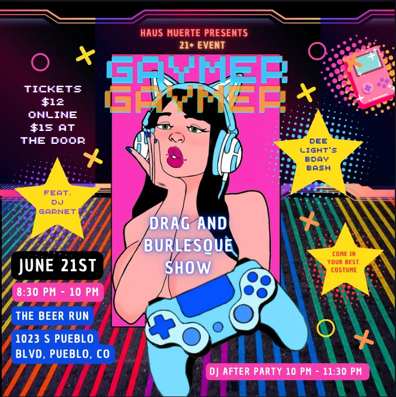

# Plan: Adding Event Flyer Thumbnail with Expandable View

## Current Structure Analysis

The current structure of the event section consists of:
- A featured image section with a background image and overlay
- An event content box positioned on the right side containing:
  - Event title
  - Event details (date, time, location)
  - A brief description
  - List of performers
  - CTA button for tickets

## Proposed Solution

We'll add a flyer thumbnail to the event content box with a modal/lightbox feature for expanding it when clicked.

### 1. HTML Modifications

We'll add the following elements:

```html
<!-- Inside the event-content-box, after event-details but before performer-list -->
<div class="flyer-thumbnail-container">
    <button class="flyer-thumbnail-button" aria-label="View event flyer">
        
        <span class="thumbnail-caption">Click to view full flyer</span>
    </button>
</div>

<!-- At the end of the body, before the script tags -->
<div id="flyer-modal" class="modal" aria-hidden="true" role="dialog" aria-label="Event flyer">
    <div class="modal-overlay"></div>
    <div class="modal-content">
        <button class="modal-close" aria-label="Close flyer">&times;</button>
        
    </div>
</div>
```

### 2. CSS Additions

We'll add styles for the thumbnail and modal to `home.css`:

```css
/* Flyer Thumbnail Styles */
.flyer-thumbnail-container {
    margin-bottom: var(--spacing-lg);
    text-align: center;
}

.flyer-thumbnail-button {
    background: none;
    border: none;
    cursor: pointer;
    padding: 0;
    position: relative;
    display: inline-block;
    transition: transform 0.3s ease;
    overflow: hidden;
    border-radius: var(--border-radius-md);
    box-shadow: 0 5px 15px rgba(0, 0, 0, 0.3), var(--glow-effect);
}

.flyer-thumbnail-button:hover {
    transform: translateY(-2px);
}

.flyer-thumbnail {
    width: 100%;
    max-width: 200px;
    height: auto;
    display: block;
    border-radius: var(--border-radius-md);
    border: 1px solid rgba(255, 255, 255, 0.1);
    transition: filter 0.3s ease;
}

.flyer-thumbnail-button:hover .flyer-thumbnail {
    filter: brightness(1.1);
}

.thumbnail-caption {
    position: absolute;
    bottom: 0;
    left: 0;
    right: 0;
    background: rgba(0, 0, 0, 0.7);
    color: var(--text-light);
    padding: var(--spacing-xs);
    font-size: 0.85rem;
    opacity: 0;
    transition: opacity 0.3s ease;
}

.flyer-thumbnail-button:hover .thumbnail-caption {
    opacity: 1;
}

/* Modal Styles */
.modal {
    display: none;
    position: fixed;
    top: 0;
    left: 0;
    right: 0;
    bottom: 0;
    z-index: 1000;
    justify-content: center;
    align-items: center;
}

.modal.open {
    display: flex;
}

.modal-overlay {
    position: absolute;
    top: 0;
    left: 0;
    right: 0;
    bottom: 0;
    background: rgba(0, 0, 0, 0.85);
    z-index: 1001;
}

.modal-content {
    position: relative;
    z-index: 1002;
    max-width: 90vw;
    max-height: 90vh;
    padding: var(--spacing-md);
    background: var(--content-bg);
    border-radius: var(--border-radius-lg);
    box-shadow: 0 25px 50px rgba(0, 0, 0, 0.5), var(--glow-effect);
    animation: modalFadeIn 0.3s cubic-bezier(0.16, 1, 0.3, 1);
}

.flyer-full {
    max-width: 100%;
    max-height: 80vh;
    object-fit: contain;
    display: block;
    border-radius: var(--border-radius-md);
}

.modal-close {
    position: absolute;
    top: 10px;
    right: 10px;
    width: 30px;
    height: 30px;
    background: var(--overlay-color-primary);
    color: var(--text-light);
    border: none;
    border-radius: 50%;
    font-size: 1.5rem;
    line-height: 1;
    cursor: pointer;
    z-index: 1003;
    transition: background 0.3s ease;
}

.modal-close:hover {
    background: var(--primary-dark);
}

@keyframes modalFadeIn {
    from {
        opacity: 0;
        transform: translateY(20px);
    }
    to {
        opacity: 1;
        transform: translateY(0);
    }
}

/* Responsive adjustments */
@media (max-width: 768px) {
    .flyer-thumbnail {
        max-width: 150px;
    }
}

/* Accessibility - focus styles */
.flyer-thumbnail-button:focus-visible,
.modal-close:focus-visible {
    outline: 2px solid var(--primary-color);
    outline-offset: 2px;
}

/* Reduced motion */
@media (prefers-reduced-motion: reduce) {
    .flyer-thumbnail-button,
    .flyer-thumbnail,
    .thumbnail-caption,
    .modal-content {
        transition: none;
        animation: none;
    }
}
```

### 3. JavaScript Functionality

We'll need to add JavaScript to handle the modal operations in `assets/js/main.js`:

```javascript
// Modal functionality for event flyer
document.addEventListener('DOMContentLoaded', function() {
    const modal = document.getElementById('flyer-modal');
    const modalOverlay = modal.querySelector('.modal-overlay');
    const modalClose = modal.querySelector('.modal-close');
    const thumbnailButton = document.querySelector('.flyer-thumbnail-button');
    
    // Open modal when thumbnail is clicked
    thumbnailButton.addEventListener('click', function() {
        modal.classList.add('open');
        document.body.style.overflow = 'hidden'; // Prevent scrolling
        modal.setAttribute('aria-hidden', 'false');
        modalClose.focus(); // Focus the close button for accessibility
    });
    
    // Function to close modal
    function closeModal() {
        modal.classList.remove('open');
        document.body.style.overflow = ''; // Restore scrolling
        modal.setAttribute('aria-hidden', 'true');
        thumbnailButton.focus(); // Return focus to thumbnail
    }
    
    // Close modal when close button is clicked
    modalClose.addEventListener('click', closeModal);
    
    // Close modal when clicking on overlay
    modalOverlay.addEventListener('click', closeModal);
    
    // Close modal when pressing Escape key
    document.addEventListener('keydown', function(e) {
        if (e.key === 'Escape' && modal.classList.contains('open')) {
            closeModal();
        }
    });
    
    // Trap focus within modal when open (accessibility)
    modal.addEventListener('keydown', function(e) {
        if (e.key === 'Tab' && modal.classList.contains('open')) {
            e.preventDefault();
            modalClose.focus();
        }
    });
});
```

## Implementation Plan

The implementation will require:

1. Adding the thumbnail container to the event content box in `index.html`
2. Adding the modal HTML structure at the end of the body in `index.html`
3. Adding the CSS to the `home.css` file
4. Adding the JavaScript to the `main.js` file

## Diagram of the Structure


## Benefits of This Approach

1. **Preserves Current Structure**: Maintains the existing site structure while adding new functionality
2. **Mobile-Friendly**: The responsive design ensures it works well on all device sizes
3. **Accessibility**: Includes proper ARIA attributes and keyboard navigation
4. **Visual Consistency**: Follows the existing design language of the site
5. **Progressive Enhancement**: Site remains functional even if JavaScript is disabled (thumbnail displays but doesn't open)

## Alternative Approaches Considered

### 1. Adding a Link to the Flyer
- **Pros**: Simpler implementation, no JavaScript required
- **Cons**: Disrupts user flow, opens in new tab/window or navigates away from main page

### 2. Embedding the Flyer as a Section
- **Pros**: Immediately visible without interaction
- **Cons**: Takes up significant space, changes page flow, could compete with featured image

### 3. Replacing Featured Image with Flyer
- **Pros**: Prominent placement
- **Cons**: Loses current aesthetic, flyer may not work well as background, compromises existing design