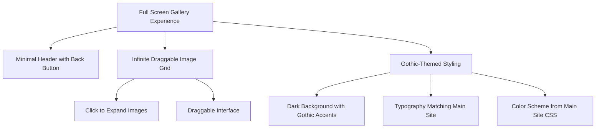

# Haus Muerte "Queers of the Wasteland" Gallery Page Plan

Based on our discussion, I've created a detailed plan for implementing a gallery page that features photos from your "Queers of the Wasteland" show.

## Overview

We'll create a full-screen gallery experience with minimal UI, focusing on showcasing the images in an immersive, interactive way. The gallery will maintain the core draggable functionality from the existing implementation but will be styled to match your site's gothic theme.

## Design Concept



## Implementation Plan

### 1. Create Basic Structure

1. Create a new HTML file (`queers-of-wasteland.html`) in the root directory
2. Implement a minimal header with a back button to return to the main site
3. Set up the container for the infinite gallery

### 2. Adapt the Existing Gallery Code

1. Copy and modify the necessary scripts from the "Infinite Gallery" folder
2. Update the image paths to use the QOW images from the "Infinite Gallery" folder
3. Modify the project titles to relate to "Queers of the Wasteland"

### 3. Adapt Styling to Match Gothic Theme

1. Modify the color scheme to match your site's gothic aesthetic:
   - Replace the default background with your site's dark background
   - Update text colors to match your site's palette
   - Add gothic accents like subtle vignette effects
2. Update typography to use your site's gothic fonts
3. Add subtle animations or effects that match your gothic theme

### 4. Optimize User Experience

1. Ensure smooth performance on all devices
2. Add appropriate page title and meta descriptions
3. Implement responsive design for various screen sizes
4. Add subtle loading transitions

### 5. Technical Specifications

#### Color Scheme Adaptation
```
- Replace black backgrounds with var(--background-dark) (#0A0000)
- Update text colors to var(--text-light) (#F0F0F0)
- Use var(--primary-color) (#800000) for accents and highlights
- Apply var(--gradient-dark) for background effects
```

#### Typography Changes
```
- Replace "PP Neue Montreal" with var(--font-heading) for titles
- Use var(--font-body) for any descriptive text
- Maintain the monospace font for certain elements but style to match the theme
```

#### UI Element Styling
```
- Style the back button with the gothic frame effect
- Add subtle gothic mist effects to the vignette
- Apply the site's transition effects to interactive elements
```

## File Structure

```
queers-of-wasteland.html
assets/
  ├── css/
  │   └── gallery.css (adapted from Infinite Gallery/style.css)
  ├── js/
  │   └── gallery.js (adapted from Infinite Gallery/script.js)
  └── images/
      └── gallery/ (images moved from Infinite Gallery folder)
```

## Implementation Timeline

1. **Setup Phase**: Create the basic structure and files
2. **Integration Phase**: Adapt the Infinite Gallery code to work with your images and theme
3. **Styling Phase**: Update all visual elements to match the gothic aesthetic
4. **Testing Phase**: Ensure functionality and appearance work across devices
5. **Launch Phase**: Finalize and integrate with the main site

## Key Features

- Full-screen immersive experience
- Infinite draggable interface for exploring images
- Click-to-expand functionality for detailed viewing
- Subtle gothic styling elements (vignettes, typography, colors)
- Minimal UI with just a back button to return to main site
- Smooth animations and transitions