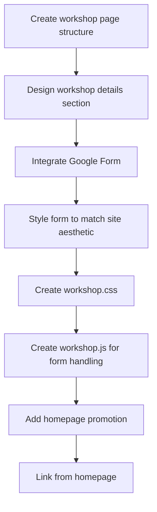

# Plan for Adding Burlesque Workshop Sign-Up Page

Based on your requirements, I'll outline a comprehensive plan for creating a dedicated workshop page with a Google Forms sign-up integration for your July 5th burlesque workshop.

## Implementation Overview



## Key Components

1. **Workshop Page Structure**
   - Create a new directory: `workshop/`
   - Create `workshop/index.html` based on your site's existing structure
   - Focus on the July 5th burlesque workshop as the only event

2. **Google Form Integration**
   - Create a Google Form with Name and Email fields
   - Configure form settings for data collection
   - Embed the form on the workshop page

3. **Visual Design & UX**
   - Match the gothic aesthetic of your current site
   - Create responsive design for all devices
   - Ensure form is easy to complete

4. **Homepage Workshop Promotion**
   - Add new section between main event and "Embrace the Darkness"
   - Create engaging call-to-action for the workshop
   - Maintain consistent gothic aesthetic

## Detailed File Structure

```
workshop/
└── index.html           # New file: Workshop page with sign-up form

assets/
├── css/
│   └── workshop.css     # New file: Workshop page styling
└── js/
    └── workshop.js      # New file: Workshop-specific JavaScript
```

[Previous HTML, CSS, and JavaScript templates remain the same...]

## Homepage Integration

A new workshop promotion section will be added to the homepage between the featured event section and the "Embrace the Darkness" section:

```html
<section class="workshop-promo">
    <div class="container">
        <div class="promo-content">
            <h2>
                <i class="fas fa-star"></i>
                Interested in Learning Burlesque?
                <i class="fas fa-star"></i>
            </h2>
            <p>Join our free workshop and discover the art of dark sensuality!</p>
            <a href="workshop/index.html" class="btn btn-primary">Join Our Workshop</a>
        </div>
    </div>
</section>
```

Add these styles to `assets/css/home.css`:

```css
/* Workshop Promo Section */
.workshop-promo {
    padding: var(--spacing-xl) 0;
    background-color: var(--bg-color-dark);
    text-align: center;
}

.workshop-promo h2 {
    font-family: 'Pirata One', cursive;
    margin-bottom: var(--spacing-md);
}

.workshop-promo h2 i {
    color: var(--accent-color);
    margin: 0 var(--spacing-sm);
}

.workshop-promo p {
    max-width: 600px;
    margin: 0 auto var(--spacing-lg);
    font-family: 'EB Garamond', serif;
    font-size: 1.2rem;
}

.workshop-promo .btn {
    font-size: 1.2rem;
    padding: var(--spacing-md) var(--spacing-lg);
}
```

## Implementation Strategy via Orchestrator Mode

The implementation will be coordinated through Orchestrator mode, which will delegate tasks to specialized modes:

1. **Planning & Structure (Architect Mode)**
   - Review and finalize page layouts
   - Confirm component relationships
   - Validate design consistency

2. **Code Implementation (Code Mode)**
   - Create workshop directory and files
   - Implement HTML structure
   - Add CSS styling
   - Write JavaScript functionality
   - Add homepage promotion section

3. **Form Integration (Debug Mode)**
   - Set up Google Form
   - Test form embedding
   - Verify submission handling
   - Check thank you message display

4. **Testing & Refinement (Debug Mode)**
   - Test responsive design
   - Verify form submissions
   - Check accessibility
   - Cross-browser testing

## Implementation Steps

1. **Create Google Form**
   - Create a form with at least name and email fields
   - Configure form settings (responses, notifications)
   - Get the embed URL

2. **Create Files**
   - Create the `workshop` directory
   - Create `workshop/index.html` using the template above
   - Create `assets/css/workshop.css` for styling
   - Create `assets/js/workshop.js` for form handling

3. **Update Homepage**
   - Add workshop promotion section
   - Style new section to match site aesthetic
   - Ensure proper linking to workshop page

4. **Testing**
   - Test the form submission process
   - Verify responsive design on mobile devices
   - Check accessibility features

## Notes on Google Form Setup

When creating your Google Form:

1. Keep it simple - just name and email fields are usually sufficient
2. Consider adding a checkbox for consent/agreement to receive communications
3. Set form to collect email addresses if you want to verify identities
4. Configure response notifications to receive emails when someone signs up
5. Consider using Google Sheets to track and manage signups

Would you like to proceed with this implementation plan using Orchestrator mode to coordinate the various aspects of the project?